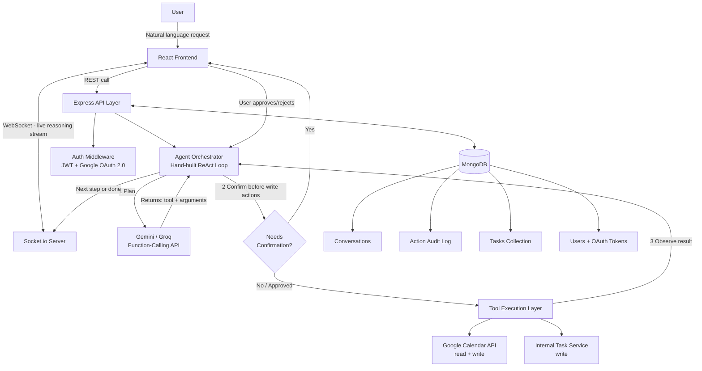
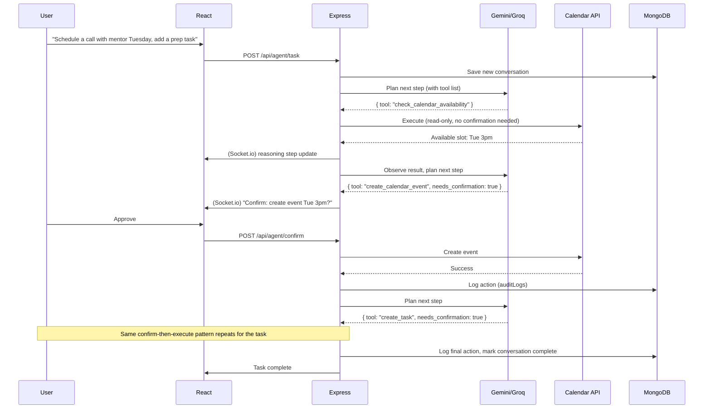

# TaskPilot — Architecture

**A MERN-based AI agent that plans and executes real-world tasks via tool-calling, with human-in-the-loop confirmation and audit logging.**

*Companion file: see `projectcontext.md` for the project's purpose, scope, and use case before diving into this technical detail.*

This version is deliberately scoped down to what's buildable solo in under 2 weeks while still fully proving the agentic pattern — see Section 9 for exactly what was cut and why.

---

## 1. What It Does

You type a natural-language request. The agent breaks it into steps, calls real tools (calendar, your task database) to execute them, streams its reasoning live to the UI, asks for confirmation before any irreversible action, and logs everything.

Example: *"Schedule a call with my mentor next Tuesday afternoon and add a follow-up task to prep for it."*
→ Agent checks calendar availability → drafts event → asks you to confirm → creates event → adds a task → logs both actions.

---

## 2. High-Level Architecture



---

## 3. The Core Loop (ReAct Pattern)

This is the heart of the project, and the only "AI" logic you write by hand (no LangChain — see Section 9 for why). Understand this well enough to explain it without notes:

```
1. REASON  → LLM receives the user's goal + conversation history + list of available tools.
             It decides: "what's the next single step toward this goal?"

2. ACT     → LLM returns a structured response: { tool: "create_calendar_event", args: {...} }
             (The LLM does NOT execute anything — it only requests an action.)

3. EXECUTE → Your Express backend receives that request, checks if it needs confirmation,
             and if approved, actually calls the real tool (Calendar API, Gmail API, etc.)

4. OBSERVE → The tool's result (success, error, returned data) is fed back to the LLM.

5. REPEAT  → LLM decides: is the goal complete, or is another step needed?
             Loop continues until done or max-steps limit is hit.
```

**Guardrail:** any step classified as a "write" action (send email, create/delete event, modify DB) pauses the loop and waits for explicit user confirmation via the UI before execution continues.

---

## 4. Component Breakdown

### 4.1 Frontend (React)
| Component | Responsibility |
|---|---|
| Chat/Request Input | Where the user types natural-language goals |
| Live Reasoning Feed | Streams each Reason → Act → Observe step in real time (Socket.io), plain text updates |
| Confirmation Modal | Simple Approve/Reject modal — blocks execution of write actions until user approves |
| Audit Log Table | Basic table of past actions: tool, timestamp, status — no filtering/search/export |
| Auth / Google Connect | OAuth flow to link Calendar access |

### 4.2 Backend (Node.js + Express)
| Module | Responsibility |
|---|---|
| `authRoutes` | JWT issuing, Google OAuth 2.0 callback handling, HttpOnly cookie sessions |
| `agentController` | Receives request, kicks off the orchestrator loop |
| `orchestrator.js` | Hand-built ReAct loop; calls LLM, manages step state, hardcoded max-step cap (e.g. 6) |
| `tools/` | One function per tool — **only 2 tools**: `checkCalendarAvailability`, `createCalendarEvent`, plus `createTask`/`completeTask` — each with a strict input schema |
| `confirmationService` | Tracks pending write-actions awaiting user approval |
| `auditLogger` | Writes every tool call (input, output, timestamp, status) to MongoDB |
| `socketGateway` | Emits reasoning steps to the connected client in real time |

### 4.3 Database (MongoDB) — Collections
| Collection | Purpose |
|---|---|
| `users` | Profile, hashed credentials, encrypted OAuth refresh tokens |
| `conversations` | Full message + reasoning history per session |
| `actionLogs` | Immutable audit trail: tool called, args, result, confirmed_by_user, timestamp |
| `tasks` | User's to-do items created/managed by the agent |
| `pendingConfirmations` | Actions awaiting explicit user approval |

### 4.4 AI / Agent Layer
| Piece | Role |
|---|---|
| Gemini API / Groq API | LLM providers, used in function-calling mode (not plain chat) |
| Hand-built orchestrator (no framework) | You write the reason → act → observe loop yourself — less total effort than learning LangChain, and far stronger to explain in an interview |
| Tool schemas | JSON-schema definitions per tool so the LLM knows what arguments to output |

### 4.5 External Tool APIs
| Tool | Used For |
|---|---|
| Google Calendar API | Check availability, create events (read + write) |
| Internal Task API (your own MongoDB-backed routes) | Add/complete to-dos (write) |

*(Gmail and web-search tools were cut — see Section 9. Add them later only as a "future work" line if time allows.)*

---

## 5. Full Tech Stack Summary

**Frontend:** React.js, Socket.io-client, Tailwind CSS
**Backend:** Node.js, Express.js, Socket.io
**Database:** MongoDB (Atlas free tier)
**Auth:** JWT (HttpOnly cookies), Google OAuth 2.0
**AI/Agent:** Gemini API, Groq API (function-calling mode) — hand-built orchestration loop, no framework
**External Tools:** Google Calendar API + internal Task API only
**Deployment:** Vercel (client), Render (server)

---

## 6. Request Lifecycle — End-to-End Example



---

## 7. Security & Guardrails (what makes this resume-credible, not a toy)

1. **Confirm-before-write** — no irreversible action (create/modify calendar event, task) executes without explicit user approval.
2. **Max-step limit** — hardcoded cap (e.g., 6 steps), not configurable — prevents infinite reasoning loops.
3. **Scoped OAuth tokens** — request only the minimum Calendar scope needed.
4. **Basic audit log** — every tool call recorded with input/output/timestamp in MongoDB, shown in a simple table.
5. **Tool input validation** — schema-check every LLM-proposed function call before execution (never trust LLM output directly).

*(Skipped: Redis-based rate limiting, retry/backoff logic, encrypted token storage — note these as "future production considerations" in your README rather than building them.)*

---

## 8. Suggested Build Order (trimmed scope, realistic 8–10 days)

1. **Days 1–2:** Understand the ReAct pattern; hand-build a raw loop with ONE fake tool (e.g., "get current time") to prove the mechanism works end to end.
2. **Days 3–4:** Add JWT + Google OAuth, MongoDB models, and the Calendar tool (read-only: check availability).
3. **Days 5–6:** Add the write-action + confirmation flow: `createCalendarEvent` with the Approve/Reject modal.
4. **Day 7:** Add the internal Task tool (`createTask`/`completeTask`) — reuses the same confirmation pattern, so it's fast to add.
5. **Day 8:** Add Socket.io live reasoning stream + the basic audit log table.
6. **Days 9–10:** Deploy (Vercel + Render), write the README explaining the architecture, record a short demo video.

---

## 9. What Was Cut, and Why (be ready to say this in an interview — it shows judgment)

| Cut | Reason |
|---|---|
| LangChain/LangGraph | Hand-rolling the loop is less total work and proves you understand the mechanism, not just a library's API |
| Gmail tool (send email) | One more OAuth scope + integration to debug for marginal payoff; drafting logic is already proven by the Calendar tool |
| Web search tool | Doesn't add a new *type* of capability — you already have a read tool and a write tool |
| Multi-user/roles | This is a single-user personal assistant, not a SaaS product — no need for permission systems |
| Redis rate limiting, retry/backoff | Real production concerns, but not needed to prove the core agentic pattern at portfolio scale |
| Configurable audit log (filter/search/export) | A basic table proves the audit-trail concept just as well |

Saying *"I cut X because it didn't add a new capability, and I prioritized Y because it did"* is a stronger answer than pretending you built everything — it shows you scope deliberately, which is exactly what engineers are expected to do.

---

## 10. Resume Bullet (once built)

> Built TaskPilot, an AI agent that plans and executes multi-step real-world tasks (calendar scheduling, task management) via natural-language input, using a hand-built ReAct-style reasoning loop with Gemini/Groq function-calling, human-in-the-loop confirmation for write actions, live reasoning stream via Socket.io, and action audit logging (MERN stack, JWT/OAuth 2.0).
